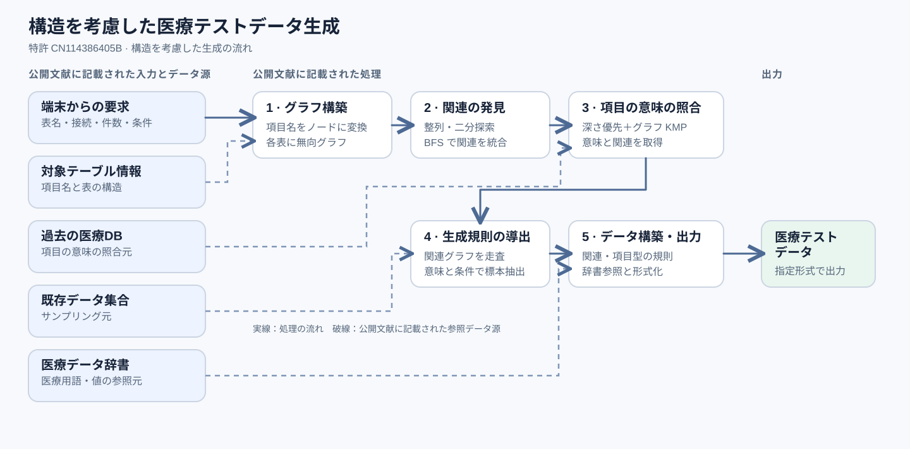

# 特許 CN114386405B：データ構造を考慮した医療テストデータの生成

> データベースのテーブル構造と医療データ源を用い、テーブルをまたぐ項目間の関係を保ちながら医療ソフトウェアのテストデータを生成する特許技術。

[英語版](README.md)と[中国語版](README.zh.md)もあります。

## 特許情報

**名称：**「医療データのインテリジェント生成方法、装置、コンピュータ設備および記憶媒体」（原題：医疗数据智能生成方法、装置、计算机设备及存储介质）  
**出願番号：**CN202210025733.5A  
**公開公報：**[CN114386405A](https://patents.google.com/patent/CN114386405A/zh)、2022年4月22日公開  
**特許公告：**[CN114386405B](https://patents.google.com/patent/CN114386405B/zh)、2025年2月7日  
**発明者：**徐卓群  
**出願人／権利者：**杭州美创科技有限公司

## 解決しようとした業務上の課題

医療システムの開発当時、私は自動テストを主導し、CI/CD の工程にテストを組み込みました。テストは単体、API、業務、データの四つのレベルで構成しました。業務レベルで登録・参照・更新・削除が正常に動作しても、データ量が増えた後の正しさまでは保証できません。たとえば、トップ画面の集計指標に誤差が生じたり、複数テーブルをまたぐ関連データに不整合が生じたりする可能性があります。

こうした問題を検証するには、十分な量があり、業務場面に合い、テーブル間の関係を保ったテストデータが必要でした。しかし、本番環境の医療データは機微性が高く、テスト用に直接取得できません。過去のデータを人手で組み合わせる方法も、量と効率の面で限界があります。そこで私は、テーブルの項目の意味と関連関係を解析し、利用可能なデータ源から生成規則を導いて医療テストデータを自動生成する方法を設計しました。

## データ項目間の依存関係

特許は、各データベーステーブルの項目をグラフのノードとして扱い、テーブルをまたぐ関連ノードを見つけ、テーブルごとのグラフを一つの関連グラフに統合します。生成規則には、**項目情報、項目型、関連関係、医療データ辞書の参照元**が記録されます。関連する項目がある場合は、値の生成に先立って関連規則を追加します。

## 技術アプローチ

1. **生成要求を受け取る。**端末からテーブル名の集合、データベース接続情報、生成件数および関連パラメータを受け取ります。
2. **テーブル構造を表現する。**各テーブルの項目名を無向グラフのノードに変換します。
3. **関連を発見する。**ノードを整列し、文献に記載された二分探索を伴う幅優先探索で関連項目を探し、関連ノードを介して各グラフを統合します。
4. **項目の意味を識別する。**深さ優先探索とグラフ構造に適合させた KMP 文字列照合を組み合わせ、過去の医療データベース内で項目を照合し、その意味と関連関係を得ます。
5. **生成規則を導出する。**関連グラフを走査し、項目の意味と端末からのパラメータに基づき既存のデータ集合からサンプリングして、結果を規則として保存します。
6. **生成して出力する。**関連項目と項目型に応じた規則を追加し、医療用語が必要な場合は医療データ辞書から抽出します。中間データを指定形式に整え、テストデータとして出力します。

*図1：特許に記載されたシステムの処理手順。*

## データの整合性が必要な理由

複数テーブルの出力では、項目をそれぞれ独立に生成するだけでは不十分です。関連項目の関係を保持しなければ、各値がもっともらしくてもテーブル間のレコードは矛盾し得ます。私の方法は関連を先に発見し、生成規則に反映することで、出力が対象のデータ構造に必要な項目間の関係を保つようにします。

## 私の貢献

本発明の技術的な作業と特許出願資料の準備を、私が独力で行いました。担当した内容は次のとおりです。

- **課題設定：**機微な本番データを取得しにくく、人手での組み合わせに費用がかかる状況で、業務場面に適した医療テストデータを自動生成するという課題を定義しました。
- **アルゴリズム設計：**グラフに基づく項目間の関連、項目照合、サンプリング、規則に基づくデータ構築をつなぐ処理手順を設計しました。
- **特許出願：**方法、装置、コンピュータ設備、記憶媒体に関する技術的な明細書、請求項、図面を準備しました。

私は[公開公報 CN114386405A](https://patents.google.com/patent/CN114386405A/zh)と[特許公告 CN114386405B](https://patents.google.com/patent/CN114386405B/zh)の両方に発明者として記載されています。

## 現在の研究との接点：構造化されたエンティティと関係

この特許の中心的な抽象化は、項目を構造化されたノードとして表し、ノード間の関連を推定し、その関係でデータ生成を制約することです。この経験は、現在の**構造化されたエンティティと関係**に関する研究につながっています。対象とそのつながりを明示し、後段の出力が必要な構造を保っているかを確かめるという考え方です。
