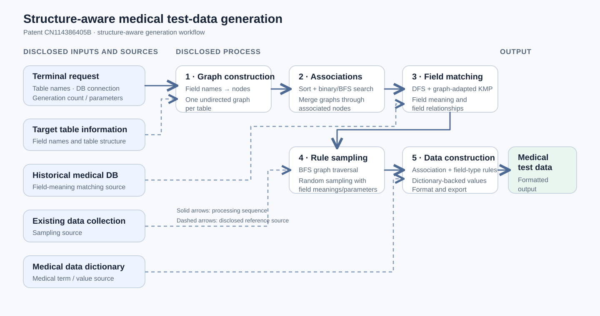

# Patent CN114386405B: Structure-Aware Generation of Medical Test Data

> A patented pipeline for generating structure-consistent medical test data from database tables and medical data sources.

Also available in [Chinese](README.zh.md) and [Japanese](README.ja.md).

## Patent record

**Title:** *Medical Data Intelligent Generation Method, Apparatus, Computer Device, and Storage Medium* (医疗数据智能生成方法、装置、计算机设备及存储介质)  
**Application:** CN202210025733.5A  
**Publication:** [CN114386405A](https://patents.google.com/patent/CN114386405A/zh), published 22 April 2022  
**Granted patent:** [CN114386405B](https://patents.google.com/patent/CN114386405B/zh), granted 7 February 2025  
**Inventor:** Xu Zhuoqun (徐卓群)  
**Applicant / assignee:** Hangzhou Meichuang Technology Co., Ltd. (杭州美创科技有限公司)

## Business problem

Medical software needs sufficiently large, scenario-relevant datasets for testing. Real clinical records are sensitive and may not be available to developers. Manually assembling historical records into test datasets is inefficient and costly, while small or unrealistic test sets may not exercise the intended workflows. I addressed this problem with an automated method that uses table information and available data sources to generate medical test data.

## Field dependencies

The patent treats a database table's fields as nodes in a graph, discovers associated nodes across tables, and merges the table-level graphs into one association graph. A generation rule records **field names, field types, field associations, and a medical-data-dictionary source**. When generating output, fields with associations receive association rules before values are constructed.

## Technical approach

1. **Receive a generation request.** A terminal supplies the set of table names, database connection information, and desired record count.
2. **Represent table structure.** Convert each table's field names into nodes of an undirected graph.
3. **Discover associations.** Sort nodes, use the described binary-search-assisted breadth-first search to identify associated fields, then merge the per-table graphs into an association graph.
4. **Identify field meaning.** Combine depth-first search with the patent's graph-adapted KMP string matching to match fields against a historical medical database and infer their meanings and associations.
5. **Derive generation rules.** Traverse the association graph, sample from an existing data collection using field meanings and terminal-supplied parameters, and retain the results as rules.
6. **Generate and export.** Add rules for associated fields and field types; when medical terms are needed, draw from a medical data dictionary; organize intermediate values in the requested format and export the test data.

*Figure 1. System workflow described in the published patent.*

## Why consistency matters

Generating each field independently is insufficient for multi-table output. If related fields are constructed without preserving their discovered relationships, the resulting test data may contain plausible individual values but inconsistent records across tables. My method discovers associations first and carries them into generation rules, so output respects the field relationships required by the target structure.

## My contribution

I independently completed the invention's technical work and prepared its patent application materials. My responsibilities included:

- **Problem definition:** framing the need for automated, scenario-relevant medical test data without relying on sensitive production records or costly manual assembly.
- **Algorithm design:** designing the structure-aware pipeline for graph-based field association, field matching, sampling, and rule-based data construction.
- **Patent application:** preparing the technical specification, claims, and figures covering the method, apparatus, computing device, and storage medium.

I am listed as the inventor on both [CN114386405A](https://patents.google.com/patent/CN114386405A/zh) and [CN114386405B](https://patents.google.com/patent/CN114386405B/zh).

## Connection to my current research: structured entities and relations

The patent's central abstraction is to turn fields into structured nodes, infer associations between them, and use those relationships to control generation. This experience informs my current research on **structured entities and relations**: representing objects and their links explicitly, then checking whether downstream outputs preserve the required structure.
