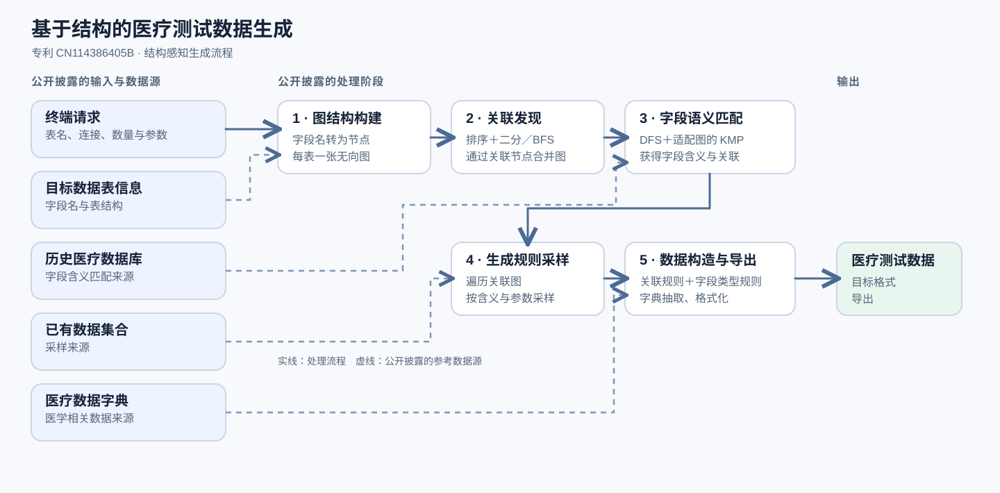

# 专利 CN114386405B：基于数据结构的医疗测试数据生成

> 一套根据数据库表结构和医疗数据源生成跨表一致医疗测试数据的专利方法。

另有[英文版](README.md)和[日文版](README.ja.md)。

## 专利信息

**名称：**《医疗数据智能生成方法、装置、计算机设备及存储介质》  
**申请号：**CN202210025733.5A  
**公开文本：**[CN114386405A](https://patents.google.com/patent/CN114386405A/zh)，2022 年 4 月 22 日公开  
**授权文本：**[CN114386405B](https://patents.google.com/patent/CN114386405B/zh)，2025 年 2 月 7 日授权  
**发明人：**徐卓群  
**申请人／专利权人：**杭州美创科技有限公司

## 要解决的业务问题

医疗软件测试需要数量足够、符合业务场景的数据。真实临床记录具有敏感性，软件开发者未必能够取得。人工组装历史数据制作测试集效率较低、成本较高，而数量少或不符合业务场景的测试数据也难以覆盖预期流程。我针对这一问题设计了结合数据表信息与可用数据源、自动生成医疗测试数据的方法。

## 数据字段之间的依赖关系

专利将每张数据库表中的字段视为图节点，寻找不同表之间的关联节点，并将各表对应的图合并成一张关联图。数据生成规则记录**字段信息、字段类型、关联关系以及医疗数据字典源**。生成数据时，若字段存在关联，方案会先为其添加关联规则，再构造字段值。

## 技术方案

1. **接收生成请求。**终端提供表名集合、数据库连接信息、生成数量及相关参数。
2. **表示表结构。**将每张表的字段名转换成无向图中的节点。
3. **发现关联。**对节点排序，使用专利描述的“二分查找辅助广度优先搜索”寻找关联字段，再通过关联节点合并各表的图。
4. **识别字段含义。**结合深度优先搜索和适配图结构的 KMP 字符串匹配，在历史医疗数据库中匹配字段，从而获得字段含义与关联关系。
5. **形成生成规则。**遍历关联图，依据字段含义和终端输入参数，从已有数据集合中采样，并将结果保存为规则。
6. **生成并导出。**为关联字段及不同字段类型添加生成规则；需要医疗相关内容时，从医疗数据字典抽取；将中间数据组织为目标格式并导出测试数据。

*图 1：专利披露的系统流程。*

## 为什么需要保证数据一致性

对于多表输出，不能只让每个字段独立生成。如果构造相关字段时不保留已发现的关联，单个字段值即使合理，跨表记录仍可能彼此矛盾。我的方法先发现关联，再把关联写入生成规则，使输出遵守目标结构所需的字段关系。

## 我的个人贡献

我独立完成了这项发明的技术工作，并准备了专利申请材料，具体包括：

- **问题定义：**明确在敏感生产记录难以获取、人工组装成本较高的条件下，自动生成符合场景的医疗测试数据的需求。
- **算法设计：**设计图结构字段关联、字段匹配、采样和规则化数据构造组成的结构感知流程。
- **专利申请：**准备方法、装置、计算机设备及存储介质相关的技术说明书、权利要求书和附图。

我在[公开文本 CN114386405A](https://patents.google.com/patent/CN114386405A/zh)和[授权文本 CN114386405B](https://patents.google.com/patent/CN114386405B/zh)中均被列为发明人。

## 与当前研究方向的连接：结构化实体与关系

这项专利的核心抽象，是将字段表示为结构化节点，推断节点之间的关联，并用这些关系约束数据生成。这段经历与我目前的**结构化实体与关系**研究直接相关：明确表示对象及其联系，并检查下游输出是否保留所需结构。
